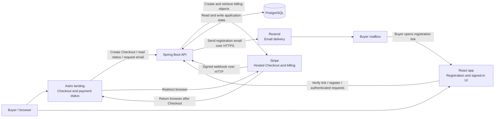
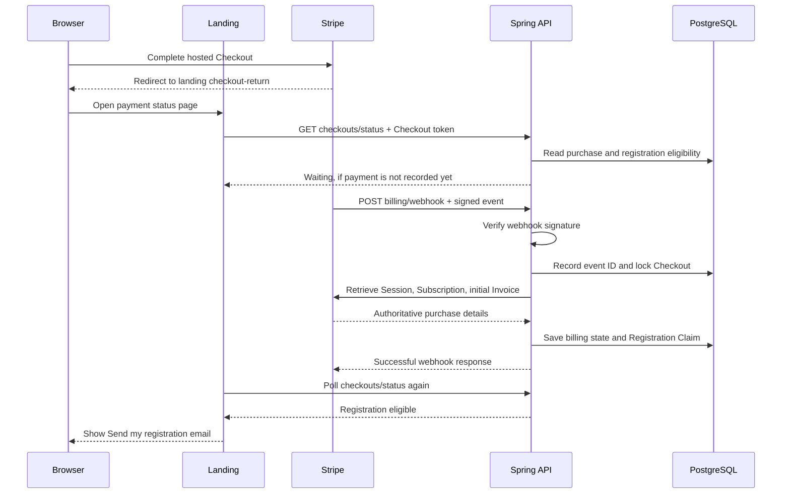
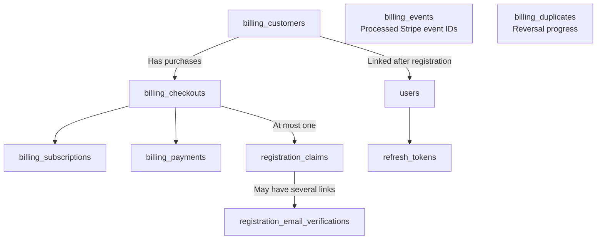

# How the backend works: payment, email verification, and registration

This guide follows the working password registration flow implemented for #93, from clicking Checkout to becoming a signed-in User. It explains the current code; configuration and smoke-test instructions are in [Stripe Checkout](stripe-checkout.md) and [Paid password registration](paid-password-registration.md).

The backend answers three questions in order:

1. **Was this purchase paid?** Stripe confirms this through a signed webhook, and the backend checks the purchase against Stripe.
2. **Can this person access the Checkout Email?** The backend sends a registration link to the email recorded by Stripe.
3. **Can this purchase create an account now?** Registration checks the link and payment again, creates the User, consumes the purchase's registration permission, and starts a session.

A payment can exist before a User exists. That separation lets someone buy first and choose their password afterward.

## Which parts communicate



The landing and React app are separate frontends. Both communicate with the same backend. Stripe owns payment processing; Resend delivers email; PostgreSQL stores JobTrackr's durable records.

Locally, the usual ports are `4321` for the landing, `5173` for React, and `8080` for Spring. Stripe cannot call your laptop directly, so the Stripe CLI forwards events to Spring. In production, Stripe calls the public webhook endpoint.

## 1. Starting Checkout

The landing calls `POST /api/v1/billing/checkouts` with an `Idempotency-Key`. This key identifies one checkout attempt so a retry does not create a second purchase accidentally.

`CheckoutService` coordinates the operation:

1. Reserve a `billing_checkouts` row in PostgreSQL, including a private Checkout return token.
2. Ask Stripe to create a hosted Checkout Session for the configured subscription price. The backend validates the configured price and supplies metadata that connects the Stripe Session to the reserved row.
3. Save the Stripe Session ID, Checkout URL, and expiry on that row.
4. Return the Checkout URL and Checkout token to the landing, which sends the browser to Stripe.

No User is created here. The Checkout Email comes from the completed Stripe purchase, rather than an email supplied to JobTrackr's checkout-creation endpoint.

The database reservation and the Stripe request are separate operations. Keeping a stable checkout identifier and Stripe idempotency key lets the backend retry after a network interruption without blindly creating another Stripe Session.

## 2. Confirming payment

Stripe's browser redirect and its webhook are independent. They can arrive in either order. Returning to the landing means the browser finished the Checkout flow; the backend still needs verified billing information.



The exact webhook endpoint is **`POST /api/v1/billing/webhook`**. `StripeWebhookVerifier` checks the raw request body against the `Stripe-Signature` header using the webhook signing secret. The handler rejects an invalid signature.

`BillingWebhookService` and `BillingEventTransactions` then reconcile the purchase:

- Store the Stripe event ID to recognize repeated deliveries.
- Find and lock the associated Checkout row. A database lock makes competing updates wait for each other.
- Retrieve the relevant Stripe objects instead of trusting the browser redirect or relying only on the event payload.
- Normalize the Checkout Email, associate the Stripe customer, and record the subscription and initial invoice outcome.
- Create a **Registration Claim** when the initial purchase is paid, Checkout is complete, the subscription is active, and its paid period is valid.

A Registration Claim is a database record meaning: “this purchase may create one User before this paid period ends.” It is not an account or a login session.

The event record and its database effects commit together. If processing fails, that transaction rolls back so Stripe can retry. Repeated delivery does not create another claim or restart the paid week.

The billing code also detects duplicate purchases for an already-paid customer/email. It records the duplicate and coordinates cancellation/refund through Stripe instead of issuing another registration claim. Those external reversal calls happen outside the database transaction; their outcomes are recorded separately so retries can continue unfinished work.

### Why the page previously kept waiting

The landing reads `GET /api/v1/billing/checkouts/status` with `X-Checkout-Token`. It does not mark a purchase paid. If the webhook never reaches the handler, the database can still say “open” even though Stripe has accepted payment.

For local development, forward to the full route:

```bash
stripe listen --forward-to localhost:8080/api/v1/billing/webhook
```

Forwarding to just `localhost:8080` sends events to the wrong endpoint. The API must also use the signing secret supplied by the active listener. See the [Stripe setup guide](stripe-checkout.md) for the complete configuration.

## 3. Sending the registration email

The **Send my registration email** button is on the landing's payment-return page after payment confirmation. Clicking it calls:

```http
POST /api/v1/auth/registration/verification
X-Checkout-Token: <private checkout token>
```

The browser does not choose the recipient. `RegistrationService` gets the email from the stored purchase and checks that registration is still allowed:

- The claim is unused and has not expired.
- The Checkout is paid.
- The Billing Customer has not already been linked to a User.
- The subscription is active and its current period includes the current time.
- A paid invoice record matches that subscription period.

It generates a random verification token and stores its **SHA-256 hash**, linked to the claim and Checkout Email. The link lasts at most **30 minutes** and never outlives the claim's paid period.

`ResendRegistrationEmailSender` calls `https://api.resend.com/emails` with the backend's Resend API key. The configured sender is `no-reply@jobtrakcr.com`. The email contains a link like:

```text
http://localhost:5173/auth/register#verify=<verification token>
```

`JOBTRACKR_PUBLIC_ORIGIN` determines the app origin in that link. In production, it should point to the public React app, such as `https://app.jobtrakcr.com`.

A successful request returns `202`. This means Resend accepted the send request; it does not prove the email reached the inbox. If the send request fails, the API returns `503` and rolls back the new token record. The purchase remains available for another attempt.

The Resend call currently runs synchronously inside the service operation; this flow has no background email queue. A database transaction cannot undo an external email delivery, so PostgreSQL and Resend do not form one atomic transaction.

## 4. Opening the email link

The link contains the token after `#`, in the URL fragment. Browsers do not send that fragment in the HTTP request used to load the React app.

Before routing, the app captures the token, saves it in that tab's `sessionStorage`, and removes the fragment from the address bar. It then calls:

```http
GET /api/v1/auth/registration/verification
X-Verification-Token: <verification token>
```

The backend hashes the received token and looks up the stored hash. It checks the token's expiry, email association, and current purchase eligibility again. A valid response supplies the fixed Checkout Email and paid-period end for the form.

Opening the link does **not** consume the claim or create a User. The form displays the email as read-only and asks for a password and optional display name. The backend still checks the submitted email; changing the HTML cannot change which email gets registered.

## 5. Creating the User and session

```mermaid
sequenceDiagram
    participant Buyer
    participant Web as React app
    participant API as Spring API
    participant DB as PostgreSQL
    participant Resend

    Buyer->>API: Request email using Checkout token
    API->>DB: Check claim and store verification token hash
    API->>Resend: Send link to stored Checkout Email
    Resend-->>Buyer: Registration email
    Buyer->>Web: Open link
    Web->>API: GET verification details using link token
    API->>DB: Check token and current paid eligibility
    API-->>Web: Fixed email and paid-until date
    Buyer->>Web: Submit password and display name
    Web->>API: POST auth/register with verification token
    API->>DB: Lock Checkout and Billing Customer
    API->>DB: Recheck token, email, and paid eligibility
    API->>DB: Create User with BCrypt password hash
    API->>DB: Consume claim and link Billing Customer to User
    API->>DB: Store refresh token hash; commit transaction
    API-->>Web: 201 + access token + HttpOnly refresh cookie
    Web-->>Buyer: Signed-in app
```

`AuthService.register` performs User creation, claim consumption, customer linking, and refresh-token persistence in one database transaction. The new User's primary email is the normalized Checkout Email and is marked verified.

The password is stored as a **BCrypt hash**. The backend does not store the original password. If the email already belongs to a User, registration returns `409`; it does not automatically merge or attach that existing account.

The Checkout and Billing Customer locks serialize simultaneous attempts. The final claim update also checks eligibility and token expiry. If two requests use the same link, the first successful registration consumes the claim; the next request fails its checks. If a required step fails, the transaction rolls back, including any newly inserted User.

Multiple emails can contain different valid links for the same purchase. They all share one claim, so successful registration makes every remaining link unusable. A form opened before expiry can also fail on submission if the link or paid period has expired in the meantime.

**Registration does not restart the paid week.** Its dates come from Stripe's billing period, not the time the person opened the email or chose a password.

## The different tokens

These values serve different purposes and are not interchangeable:

| Value | Purpose | Where it lives |
| --- | --- | --- |
| Checkout token | Read one purchase's status and request its registration email | Private return URL fragment / landing tab storage; stored on the Checkout row |
| Verification token | Authorize registration for the email reached through the link | Email link, then React tab storage; only its hash is stored in PostgreSQL |
| Access token | Authenticate signed-in API requests | Signed JWT returned to React and held in JavaScript memory |
| Refresh token | Obtain another access token without entering the password again | HttpOnly browser cookie; only its hash is stored in PostgreSQL |
| Stripe webhook signing secret | Verify that webhook requests were signed by Stripe | Backend configuration; not a browser token |
| Stripe and Resend API keys | Let the backend call those providers | Backend configuration; not returned to either frontend |

The Checkout token permits requesting an email, but does not prove mailbox access. The verification token permits registration, but does not serve as a general login token.

After successful registration, React clears the verification token from its tab storage.

## What happens after registration

The browser sends the access JWT in `Authorization: Bearer <token>` for authenticated API calls. The backend's JWT filter validates it and checks the associated User's authentication state. React keeps this access token in memory.

The refresh token is in an **HttpOnly cookie**, so frontend JavaScript cannot read it directly. When the app needs a new access token, it calls `POST /api/v1/auth/refresh`; the browser supplies the cookie. The backend validates and rotates the refresh token, persists the replacement hash, and returns a new access token and cookie.

Logout revokes the supplied refresh token and clears the cookie. Access tokens have their own expiry.

An authenticated session answers “which User is making this request?” The registration payment checks answer “may this purchase create a User now?” Applying paid entitlement checks to later product operations is a separate concern; a JWT is not proof of a currently paid subscription.

## What PostgreSQL stores



Arrows here show relationships, not the direction of network requests.

| Table | What it records |
| --- | --- |
| `billing_checkouts` | JobTrackr checkout attempt, return token, Stripe Session reference, URL, expiry, and state |
| `billing_customers` | Checkout Email, Stripe customer reference, and eventual User link |
| `billing_subscriptions` | Stripe subscription reference, status, and billing period |
| `billing_payments` | Invoice reference, payment outcome, and associated period |
| `registration_claims` | One purchase's registration permission, paid start, expiry, and consumption time |
| `registration_email_verifications` | Verification token hashes, claim references, fixed emails, and link expiries |
| `billing_events` | Stripe event IDs used to recognize repeated webhook delivery |
| `billing_duplicates` | Progress of duplicate-purchase cancellation/refund handling |
| `users` | Login identity, password hash, verified email, profile, and authentication state |
| `refresh_tokens` | Refresh-token hashes, expiry, revocation, and replacement/family information |

Flyway manages schema migrations. Billing and registration repositories use explicit SQL through `JdbcClient`; User and refresh-token persistence use JPA. They participate in the same PostgreSQL transactions where the service defines a shared transaction.

## Where to read the code

Paths below are relative to the repository. Start with the services; controllers translate HTTP requests into service calls, and repositories handle database queries.

| Part | Main code |
| --- | --- |
| Reserve and create Checkout | [CheckoutService.java](../JobTrackrApi/src/main/java/com/ricard0g/jobtrackr_api/billing/CheckoutService.java) |
| Call Stripe | [StripeApiGateway.java](../JobTrackrApi/src/main/java/com/ricard0g/jobtrackr_api/billing/StripeApiGateway.java) |
| Verify webhook authenticity | [StripeWebhookVerifier.java](../JobTrackrApi/src/main/java/com/ricard0g/jobtrackr_api/billing/StripeWebhookVerifier.java) |
| Process events and reconcile purchases | [BillingWebhookService.java](../JobTrackrApi/src/main/java/com/ricard0g/jobtrackr_api/billing/BillingWebhookService.java), [BillingEventTransactions.java](../JobTrackrApi/src/main/java/com/ricard0g/jobtrackr_api/billing/BillingEventTransactions.java) |
| Read payment status | [BillingStatusService.java](../JobTrackrApi/src/main/java/com/ricard0g/jobtrackr_api/billing/BillingStatusService.java) |
| Create and check email links | [RegistrationService.java](../JobTrackrApi/src/main/java/com/ricard0g/jobtrackr_api/registration/RegistrationService.java) |
| Check eligibility, lock rows, consume claim | [RegistrationRepository.java](../JobTrackrApi/src/main/java/com/ricard0g/jobtrackr_api/registration/RegistrationRepository.java) |
| Deliver email through Resend | [ResendRegistrationEmailSender.java](../JobTrackrApi/src/main/java/com/ricard0g/jobtrackr_api/registration/ResendRegistrationEmailSender.java) |
| Create User and issue session | [AuthService.java](../JobTrackrApi/src/main/java/com/ricard0g/jobtrackr_api/service/AuthService.java), [AuthController.java](../JobTrackrApi/src/main/java/com/ricard0g/jobtrackr_api/controller/AuthController.java) |
| Manage refresh tokens | [RefreshTokenService.java](../JobTrackrApi/src/main/java/com/ricard0g/jobtrackr_api/service/RefreshTokenService.java) |
| Show payment status and request email | [checkout-return.astro](../jobtrackr-landing/src/pages/checkout-return.astro) |
| Capture email link and handle registration | [registration-token.ts](../jobtrackr-web/src/lib/registration-token.ts), [auth.tsx](../jobtrackr-web/src/routes/auth.tsx) |

## Useful failure signals

| What you see | Which boundary to inspect |
| --- | --- |
| Payment status keeps waiting | Stripe webhook delivery, the forwarding URL, signing secret, and recorded Checkout state |
| Webhook returns `400` | Signature or event validation; check that the configured secret belongs to that webhook endpoint/listener |
| Email request returns `503` | Resend API key, sender configuration, app origin, and provider/network response |
| Email request returns `202`, but no inbox message | Resend delivery status and the recipient's spam folder; acceptance is separate from delivery |
| Registration link returns `403` | Unknown/expired token, consumed claim, ended paid period, or changed billing eligibility |
| Registration returns `409` | The Checkout Email already belongs to a User |
| Request returns `429` | The authentication/registration rate limit |

Public password signup now requires a valid verification token. [Paid Google registration](paid-google-registration.md) consumes the same claim; email recovery without the Checkout return token are separate follow-up work.
