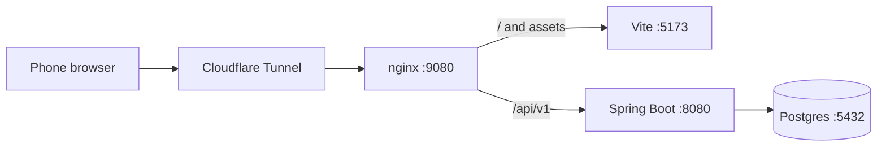

# Cloudflare Tunnel (Phone Testing)

Use this workflow when a user wants to open **JobTrackr on a phone** (or any external device) from a cloud agent environment through a **single Cloudflare quick tunnel**.

This is not the VPS named-tunnel path. Standalone VPS routing through host Nginx and Cloudflare Access is documented in [`docs/deploying-vps.md`](../../../docs/deploying-vps.md).

nginx reverse-proxies both the Vite frontend and the Spring Boot API behind one origin, so the phone never calls `localhost:8080`. `cloudflared` exposes that nginx origin over HTTPS with a random `*.trycloudflare.com` URL — no account or authtoken required.

## Architecture



**Default mode:** full stack (Postgres + API + Vite).

**Mock shortcut:** Vite + MSW only (no backend) via `./scripts/cloud-tunnel-up.sh --mock`.

## Prerequisites

1. **Dependencies installed**

   ```bash
   npm install
   ```

2. **nginx and cloudflared available**

   ```bash
   nginx -v
   cloudflared --version
   ```

   If nginx is missing: `sudo apt-get install -y nginx` (or your platform equivalent).

   If cloudflared is missing, install from Cloudflare's package or GitHub releases, for example:

   ```bash
   # Debian/Ubuntu example
   curl -fsSL https://github.com/cloudflare/cloudflared/releases/latest/download/cloudflared-linux-amd64.deb -o /tmp/cloudflared.deb
   sudo dpkg -i /tmp/cloudflared.deb
   ```

3. **Code prerequisites (required for tunneling to work)**

   **`vite.config.ts`** — allow tunnel hostnames and optional HMR through Cloudflare:

   ```ts
   server: {
     allowedHosts: [".trycloudflare.com"],
     hmr: process.env.VITE_HMR_HOST
       ? { host: process.env.VITE_HMR_HOST, protocol: "wss", clientPort: 443 }
       : true,
   },
   ```

   **`src/lib/api-config.ts`** — use same-origin relative API paths when mocking or when `VITE_API_ORIGIN` is empty:

   ```ts
   const isMocking = import.meta.env.VITE_API_MOCKING === "true";

   const resolvedOrigin = (
     isMocking
       ? ""
       : (configuredOrigin ??
           legacyApiUrl?.replace(/\/api\/v1\/?$/, "") ??
           "http://localhost:8080")
   ).replace(/\/$/, "");

   export const API_BASE_URL = resolvedOrigin ? `${resolvedOrigin}/api/v1` : "/api/v1";
   export const AUTH_BASE_URL = resolvedOrigin ? `${resolvedOrigin}/api/v1/auth` : "/api/v1/auth";
   ```

   **Why:** On a phone, `localhost:8080` refers to the phone itself. Through nginx, `/api/v1` hits the real API on the same Cloudflare origin. Without relative paths, login may fail with **Error 500** (`Failed to fetch`).

## Quick start

From the repo root:

```bash
./scripts/cloud-tunnel-up.sh
```

This script:

1. Starts Postgres and the API (full stack)
2. Starts Vite with `VITE_API_MOCKING=false` and `VITE_API_ORIGIN=` (relative API paths)
3. Sets `JWT_REFRESH_COOKIE_SECURE=true` for the HTTPS tunnel origin
4. Starts nginx on `localhost:9080` using [`config/nginx/cloud-dev.conf`](../../../config/nginx/cloud-dev.conf)
5. Starts a quick tunnel: `cloudflared tunnel --url http://localhost:9080`
6. Restarts Vite with `VITE_HMR_HOST` set from the `*.trycloudflare.com` hostname

Mock-only shortcut:

```bash
./scripts/cloud-tunnel-up.sh --mock
```

Stop everything:

```bash
./scripts/cloud-tunnel-down.sh
```

## Manual tmux steps

Use **tmux** for long-running processes when not using the script.

### 1. Postgres and API (full stack only)

```bash
./scripts/dev-up.sh
tmux -f /exec-daemon/tmux.portal.conf new-session -d -s api-dev-server -c /workspace \
  -- bash -lc './scripts/dev-api.sh'
```

Wait until `http://localhost:8080/actuator/health` returns `{"status":"UP"}`.

### 2. Vite dev server

Full stack:

```bash
tmux -f /exec-daemon/tmux.portal.conf new-session -d -s vite-dev-server -c /workspace/jobtrackr-web \
  -- bash -lc 'env VITE_API_MOCKING=false VITE_API_ORIGIN= npm run dev'
```

Mock only:

```bash
tmux -f /exec-daemon/tmux.portal.conf new-session -d -s vite-dev-server -c /workspace/jobtrackr-web \
  -- bash -lc 'env VITE_API_MOCKING=true npm run dev'
```

Notes:

- Do **not** pass `--host 127.0.0.1`. Default Vite binds to `localhost`.
- Wait until `http://localhost:5173/` returns HTTP 200.

### 3. nginx reverse proxy

Full stack:

```bash
tmux -f /exec-daemon/tmux.portal.conf new-session -d -s nginx-proxy -c /workspace \
  -- bash -lc "nginx -c '/workspace/config/nginx/cloud-dev.conf' -g 'daemon off;'"
```

Mock only:

```bash
tmux -f /exec-daemon/tmux.portal.conf new-session -d -s nginx-proxy -c /workspace \
  -- bash -lc "nginx -c '/workspace/config/nginx/cloud-dev-mock.conf' -g 'daemon off;'"
```

Wait until `http://localhost:9080/` returns HTTP 200.

### 4. Cloudflare quick tunnel

**Important:** Point cloudflared at nginx on `localhost:9080`, not Vite `:5173` or API `:8080`.

```bash
rm -f /tmp/jobtrackr-cloudflared.log
tmux -f /exec-daemon/tmux.portal.conf new-session -d -s cloudflared-tunnel -c /workspace \
  -- bash -lc 'cloudflared tunnel --url http://localhost:9080 2>&1 | tee /tmp/jobtrackr-cloudflared.log'
```

### 5. Read the public URL

```bash
grep -oE 'https://[a-zA-Z0-9-]+\.trycloudflare\.com' /tmp/jobtrackr-cloudflared.log | head -n1
```

### 6. Optional: enable Vite HMR through the tunnel

Extract the tunnel hostname and restart Vite:

```bash
export TUNNEL_URL="<https-url-from-step-5>"
export VITE_HMR_HOST="$(python3 -c "from urllib.parse import urlparse; print(urlparse('$TUNNEL_URL').hostname)")"
tmux -f /exec-daemon/tmux.portal.conf kill-session -t vite-dev-server 2>/dev/null
tmux -f /exec-daemon/tmux.portal.conf new-session -d -s vite-dev-server -c /workspace/jobtrackr-web \
  -- bash -lc "export VITE_HMR_HOST='$VITE_HMR_HOST'; env VITE_API_MOCKING=false VITE_API_ORIGIN= npm run dev"
```

If skipped, the app still works with manual refresh.

## Verify before handing off to the user

```bash
TUNNEL_URL="<https-url>"

# App HTML
curl -s -o /dev/null -w "%{http_code}\n" "$TUNNEL_URL/"

# API routing (full stack)
curl -s "$TUNNEL_URL/api/v1/auth/csrf"

# MSW service worker (mock mode)
curl -sI "$TUNNEL_URL/mockServiceWorker.js" | grep -i content-type
```

Expect `200` for the app, JSON for `/api/v1/auth/csrf` (full stack), and `text/javascript` for the service worker (mock mode).

## Tell the user

Share the Cloudflare `https://*.trycloudflare.com` URL and these phone steps:

1. Open the URL in the mobile browser.
2. Log in:
   - **Full stack:** `agent@example.test` / `dev-password` (see [`docs/development.md`](../../../docs/development.md))
   - **Mock mode:** demo account in [`mock-service-worker.md`](../mock-service-worker.md#demo-account)
3. If the page looks stale after a restart, hard-refresh.

No interstitial warning page — open the URL and use the app.

## Restarting

```bash
./scripts/cloud-tunnel-down.sh
./scripts/cloud-tunnel-up.sh
```

The quick-tunnel URL changes on each `cloudflared` restart.

## Troubleshooting

| Symptom | Cause | Fix |
|--------|--------|-----|
| `Missing required command: nginx` | nginx not installed | `sudo apt-get install -y nginx` |
| `Missing required command: cloudflared` | cloudflared not installed | Install from Cloudflare releases (see Prerequisites) |
| Tunnel returns empty / connection refused | cloudflared targets wrong port | Use `cloudflared tunnel --url http://localhost:9080` (nginx), not `:5173` or `:8080` |
| Failed to read public URL from log | Tunnel still connecting | Wait a few seconds and re-grep `/tmp/jobtrackr-cloudflared.log` |
| nginx 502 Bad Gateway | API or Vite not running | Check tmux sessions; verify `localhost:8080/actuator/health` and `localhost:5173/` |
| App loads locally but tunnel gets **403** | Vite host check blocks Cloudflare hostname | Add `server.allowedHosts: [".trycloudflare.com"]` in `vite.config.ts` |
| Login page loads, submit shows **Error 500** | API calls go to `http://localhost:8080` on the phone | Use `VITE_API_ORIGIN=` (empty) or `VITE_API_MOCKING=true`; route API through nginx |
| Login shows **Invalid email or password** on full stack | Stale MSW service worker from an earlier `--mock` session | Hard-refresh; clear site data; full-stack mode auto-unregisters MSW on load |
| Login shows **No se pudo completar la autenticacion** | Browser `Origin` is the tunnel URL but API CORS only allows `localhost` | Ensure `CorsConfig` allows `https://*.trycloudflare.com` |
| Login succeeds but session drops | Refresh cookie not secure on HTTPS | Set `JWT_REFRESH_COOKIE_SECURE=true` (done by `cloud-tunnel-up.sh`) |
| HMR does not connect on phone | Vite advertises `localhost` for WebSocket | Restart Vite with `VITE_HMR_HOST=<tunnel-host>` or refresh manually |
| `bash: nv: command not found` in tmux | Partial/corrupted `send-keys` in tmux | Kill sessions and recreate with `bash -lc '…'` one-shot commands |

## Related docs

- [`mock-service-worker.md`](../mock-service-worker.md) — mock API env var, demo account, persistence
- [`AGENTS.md`](../../AGENTS.md) — React Router Data Mode conventions for this repo
- [`docs/development.md`](../../../docs/development.md) — full-stack setup and seed data
